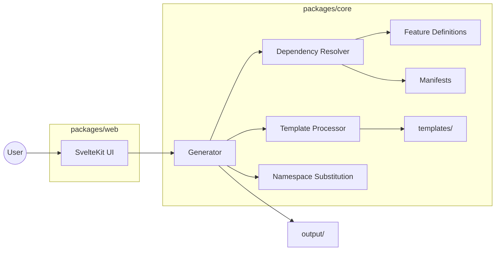
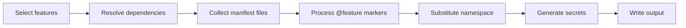

# netrock-cli

**.NET API project generator.** Pick features, preview, download - entirely in the browser.

**[Try the generator](https://netrock.dev)** (alpha) | [Main repo (netrock)](https://github.com/fpindej/netrock) | [Buy me a coffee](https://buymeacoffee.com/fpindej)

> This generator is in alpha - built 99% with [Claude](https://claude.ai) based on the original [netrock](https://github.com/fpindej/netrock) repository. Expect rough edges. Issues and PRs are very welcome at both repos.

## What it does

You pick a project name, choose features, and get a complete .NET 10 API project as a zip - builds, tests pass, ready to deploy. No server needed, everything runs client-side.

## Try it

### Web (recommended)

Visit **[netrock.dev](https://netrock.dev)** - pick features, preview the file tree, download a zip.

### CLI (local)

```bash
git clone https://github.com/fpindej/netrock-cli.git
cd netrock-cli
pnpm install
pnpm generate
```

The interactive CLI asks for a project name and lets you pick a preset or choose features individually. Output goes to `output/<project-name>/`.

```bash
cd output/your-project
dotnet build src/backend/YourProject.slnx
dotnet test src/backend/YourProject.slnx
```

## What you get

A generated project includes:

- **.NET 10 API** - Clean Architecture (Domain, Shared, Application, Infrastructure, WebApi)
- **PostgreSQL** - EF Core with strongly-typed configuration
- **Health checks** - Readiness and liveness endpoints
- **OpenAPI** - Auto-generated API documentation
- **Serilog** - Structured logging with OpenTelemetry support
- **Security** - CORS, rate limiting, security headers, exception handling middleware
- **Tests** - Architecture tests (NetArchTest), unit tests, API integration tests (xUnit)
- **Docker** - Dockerfile and build configuration

## Features

Features are modular. Pick what you need, skip what you don't. Dependencies are resolved automatically.

| Feature | Description | Dependencies |
|---|---|---|
| **Core** | Clean Architecture skeleton, PostgreSQL, health checks | (always included) |
| **Authentication** | Local login, registration, JWT + refresh tokens, email (SMTP + templates), email verification, password reset | Core |
| **Two-factor auth** | TOTP-based 2FA with recovery codes | Auth |
| **External OAuth** | Google, GitHub, Microsoft, and more | Auth |
| **Captcha** | Cloudflare Turnstile on register and forgot password | Auth |
| **Background jobs** | Hangfire job scheduling with PostgreSQL storage | Auth |
| **File storage** | S3/MinIO file storage abstraction | Core |
| **Avatar uploads** | User avatar upload with image processing | Auth, File storage |
| **Audit trail** | Event logging for security-sensitive actions | Core |
| **Admin panel** | User management, role management, system admin | Auth, Audit |
| **Aspire** | .NET Aspire for local dev orchestration with OTEL | Core |
| **SvelteKit frontend** | Full reference frontend with all feature UIs | Auth (coming soon) |

### Presets

| Preset | What's included |
|---|---|
| **Minimal** | Core + Auth |
| **Standard** | Core, Auth, Jobs, Audit, Admin, Aspire |
| **Full** | All 11 backend features |

## Architecture



### Generation pipeline



## Project structure

```
netrock-cli/
  packages/
    core/           Pure TypeScript engine (no framework dependencies)
      src/
        engine/     Generator, template processor, naming, secrets
        features/   Feature definitions, dependency graph
        graph/      Dependency resolver
        manifests/  Per-feature file declarations (11 manifests, 410 files)
        presets/    Preset configurations
      tests/        Unit + integration tests (vitest)
    web/            SvelteKit static site (the generator UI)
      src/
        lib/        Components, stores, utilities
        routes/     Single-page app with scroll-based navigation
  scripts/
    generate.ts     Interactive CLI script
    deploy.sh       Docker build + push to Docker Hub
  templates/        Source template files (valid .NET code with @feature markers)
```

## How it works

1. **Feature resolution** - Your selection is expanded with required dependencies
2. **File collection** - Each enabled feature's manifest declares which template files to include
3. **Template processing** - Files with `@feature` markers have conditional blocks stripped or kept based on your selection
4. **Namespace substitution** - `MyProject` placeholder is replaced with your project name in PascalCase (paths, content, DB context, solution file)
5. **Secret generation** - JWT signing key and encryption key are generated fresh

### Template markers

Template files are valid, compilable C# code. Conditional sections use comment markers:

```csharp
// @feature auth
using MyProject.Infrastructure.Features.Authentication;
// @end

// @feature !auth
internal class MyProjectDbContext(DbContextOptions<MyProjectDbContext> options) : DbContext(options)
// @end
// @feature auth
internal class MyProjectDbContext(DbContextOptions<MyProjectDbContext> options)
    : IdentityDbContext<ApplicationUser, ApplicationRole, Guid>(options)
// @end
```

`@feature name` keeps the block when the feature is enabled. `@feature !name` keeps it when the feature is disabled. Both markers are stripped from output.

Markers work across file types:
- C#/TypeScript/JSON: `// @feature name` ... `// @end`
- HTML/Svelte/XML: `<!-- @feature name -->` ... `<!-- @end -->`
- YAML/shell: `# @feature name` ... `# @end`

## Development

```bash
pnpm install
pnpm test          # Run all tests
pnpm build         # Build all packages
pnpm generate      # Try the CLI generator
pnpm dev           # Run the web UI locally
```

### Tests

```bash
pnpm --filter @netrock/core test    # Unit + integration tests
pnpm --filter @netrock/web build    # Verify web build
```

Integration tests generate full projects and verify the output compiles and passes `dotnet build` + `dotnet test`.

### Deploy

```bash
./scripts/deploy.sh         # Build + push to Docker Hub (linux/amd64)
./scripts/deploy.sh v0.1.0  # With version tag
```

## Progress

- [x] Phase 1 - Feature mapping (12 features defined with dependency graph)
- [x] Phase 2 - Core engine (dependency resolver, template processor, namespace substitution, presets)
- [x] Phase 3 - Feature modules (11 backend features with manifests and cross-cutting markers)
- [ ] Phase 3 - SvelteKit frontend templates (#79)
- [x] Phase 4 - Testing (snapshot tests, feature combination matrix, build verification)
- [x] Web UI - Interactive generator (alpha, live)
- [ ] Phase 5 - Launch (domain, analytics, docs, releases)

### Verified combinations

All feature combinations generate projects that build and pass their full test suites:

| Combination | dotnet tests |
|---|---|
| Core-only | 10 |
| Minimal (Core + Auth) | 349 |
| Standard (6 features) | 916 |
| Full (11 features) | 1,041 |

9 feature combinations tested in CI across the full matrix.

## Related

- **[netrock](https://github.com/fpindej/netrock)** - The original .NET + SvelteKit production template this generator is based on
- **[netrock.dev](https://netrock.dev)** - Live generator (alpha)

## License

MIT
