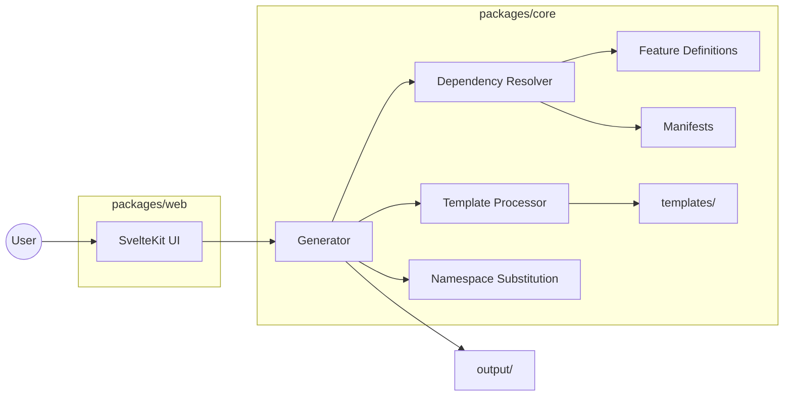
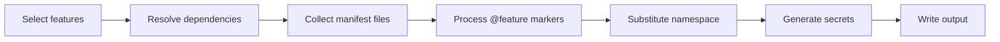

# Netrock

Project generator for production-grade .NET + SvelteKit web applications.

Pick your features, name your project, get a complete repository - builds, tests pass, ready to deploy.

## Quick start

```bash
git clone https://github.com/fpindej/netrock-cli.git
cd netrock-cli
pnpm install
pnpm generate
```

The interactive generator asks for a project name, lets you pick a preset or choose features individually, and writes the project to `output/<project-name>/`.

```
cd output/your-project
dotnet build src/backend/YourProject.slnx
dotnet test src/backend/YourProject.slnx
```

## What you get

A generated project includes:

- **.NET 10 API** - Clean Architecture (Domain, Shared, Application, Infrastructure, WebApi)
- **PostgreSQL** - EF Core with strongly-typed configuration
- **Health checks** - Readiness and liveness endpoints
- **OpenAPI** - Auto-generated API documentation
- **Serilog** - Structured logging with OpenTelemetry support
- **Security** - CORS, rate limiting, security headers, exception handling middleware
- **Tests** - Architecture tests (NetArchTest) and unit tests (xUnit)
- **Docker** - Dockerfile and build configuration

## Features

Features are modular. Pick what you need, skip what you don't. Dependencies are resolved automatically.

| Feature | Description | Dependencies |
|---|---|---|
| **Core** | Clean Architecture skeleton, PostgreSQL, health checks | (always included) |
| **Authentication** | Local login, registration, token refresh, user profile | Core |
| **Email** | SMTP service with Fluid templates | Core |
| **Email verification** | Confirmation token flow | Auth, Email |
| **Password reset** | Forgot/reset password via email | Auth, Email |
| **Two-factor auth** | TOTP-based 2FA with recovery codes | Auth |
| **External OAuth** | Google, GitHub, Microsoft, and more | Auth |
| **Captcha** | Cloudflare Turnstile on register and forgot password | Auth |
| **Background jobs** | Hangfire job scheduling with PostgreSQL storage | Core |
| **File storage** | S3/MinIO file storage abstraction | Core |
| **Avatar uploads** | User avatar upload with image processing | Auth, File storage |
| **Audit trail** | Event logging for security-sensitive actions | Core |
| **Admin panel** | User management, role management, system admin | Auth |
| **Aspire** | .NET Aspire for local dev orchestration with OTEL | Core |
| **SvelteKit frontend** | Full reference frontend with all feature UIs | Auth |

### Presets

| Preset | What's included |
|---|---|
| **Minimal** | Core + Auth |
| **Standard** | Core, Auth, Email, Email verification, Password reset, Jobs, Audit, Admin, Aspire, Frontend |
| **Full** | Everything |
| **API only** | Everything except the SvelteKit frontend |

## Architecture



### Generation pipeline



## Project structure

```
netrock-cli/
  packages/
    core/           Pure TypeScript engine (no framework dependencies)
      src/
        engine/     Generator, template processor, naming, secrets
        features/   Feature definitions, dependency graph, manifests
        graph/      Dependency resolver
        manifests/  Per-feature file declarations (14 manifests, 410 files)
        presets/    Preset configurations
      tests/        Unit + integration tests (vitest)
  scripts/
    generate.ts     Interactive CLI script
  templates/        Source template files (valid .NET code with @feature markers)
```

## How it works

1. **Feature resolution** - Your selection is expanded with required dependencies
2. **File collection** - Each enabled feature's manifest declares which template files to include
3. **Template processing** - Files with `@feature` markers have conditional blocks stripped or kept based on your selection
4. **Namespace substitution** - `MyProject` placeholder is replaced with your project name in PascalCase (paths, content, DB context, solution file)
5. **Secret generation** - JWT signing key and encryption key are generated fresh

### Template markers

Template files are valid, compilable C# code. Conditional sections use comment markers:

```csharp
// @feature auth
using MyProject.Infrastructure.Features.Authentication;
// @end

// @feature !auth
internal class MyProjectDbContext(DbContextOptions<MyProjectDbContext> options) : DbContext(options)
// @end
// @feature auth
internal class MyProjectDbContext(DbContextOptions<MyProjectDbContext> options)
    : IdentityDbContext<ApplicationUser, ApplicationRole, Guid>(options)
// @end
```

`@feature name` keeps the block when the feature is enabled. `@feature !name` keeps it when the feature is disabled. Both markers are stripped from output.

Markers work across file types:
- C#/TypeScript/JSON: `// @feature name` ... `// @end`
- HTML/Svelte/XML: `<!-- @feature name -->` ... `<!-- @end -->`
- YAML/shell: `# @feature name` ... `# @end`

## Development

```bash
pnpm install
pnpm test          # Run all tests
pnpm build         # Build all packages
pnpm generate      # Try the generator
```

### Tests

```bash
cd packages/core
pnpm test              # All 56 tests
pnpm test:watch        # Watch mode
```

Integration tests generate a full project, run `dotnet build` and `dotnet test` on it, and verify the output compiles and passes.

## Progress

- [x] Phase 1 - Feature mapping (14 features defined with dependency graph)
- [x] Phase 2 - Core engine (dependency resolver, template processor, namespace substitution, presets, scaffolding)
- [x] Phase 3 - Feature modules (13/14 backend features with manifests and cross-cutting `@feature` markers)
- [ ] Phase 3 - SvelteKit frontend module
- [ ] Phase 4 - Testing (snapshot tests, feature combination matrix, build verification)
- [ ] Web UI - Interactive generator at netrock.dev

### Verified presets

All presets generate projects that build and pass their full test suites:

| Preset | Features | dotnet tests |
|---|---|---|
| Core-only | Core | 56 (TypeScript integration) |
| Minimal | Core + Auth | 349 |
| Full | All 14 features | 1041 |

## License

MIT
